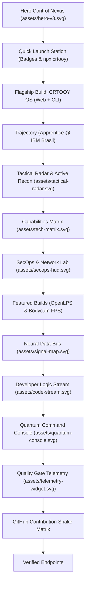

# CRTOOY PROFILE // QUANTUM VISUAL SYSTEM V4 — SPECIFICATION

> Visual architecture and engineering specification for Gabriel Silva's GitHub Profile Nexus.

---

## 1. System Vision & Architecture

The **CRTOOY Visual System v4 (Quantum Nexus)** transforms the profile into an **interactive cyber-command telemetry hub**, blending:
1. **Developer Operating System (CRTOOY OS & CLI)**
2. **Defensive SecOps & Network Research Lab (OpenLPS)**
3. **3D WebGL & Tactical Simulations (Bodycam FPS)**
4. **Apprentice Trajectory at IBM Brasil**
5. **Applied AI & Agentic Architectures**

---

## 2. Asset Matrix & Telemetry

| Asset File | Dimensions | Purpose & Motion Features |
| :--- | :--- | :--- |
| `assets/hero-v3.svg` | `800 x 320` | Cyber-command header with IBM authentic 8-bar seal, rotating radar beacon, equalizer spectrum, and smooth boot sequence. |
| `assets/tactical-radar.svg` | `800 x 240` | 360° Polar radar sweep with 4 target blips and live acquisition details. |
| `assets/tech-matrix.svg` | `800 x 240` | 4 diagnostic quadrants (Systems, AI, SecOps, 3D Graphics) with glowing progress indicators. |
| `assets/secops-hud.svg` | `800 x 220` | Defensive security lab with Shannon entropy analyzer and scanning beam. |
| `assets/signal-map.svg` | `800 x 150` | Neural data-bus with animated flowing packets synchronizing 5 subnets. |
| `assets/code-stream.svg` | `800 x 140` | Streaming IDE window with TypeScript 5.7 strict code and live process prompt. |
| `assets/quantum-console.svg` | `800 x 200` | Simulated zsh terminal running `crtooy --system-status` with live blinking cursor. |
| `assets/telemetry-widget.svg` | `800 x 130` | Real-time oscilloscope wave with Vitest and CI/CD quality gate readouts. |

---

## 3. Strict Compliance & Camo Proxy Safety

- **100% Strict XML**: Fully validated with zero undeclared HTML entities.
- **Absolute Coordinate Layout**: Zero text overlap or jumping under variable font rendering.
- **Opaque Base Container (`#080c14`)**: Crisp high-contrast appearance in GitHub Dark, Dark Dimmed, and Light themes.
- **Reduced Motion Support**: All CSS keyframes gracefully fallback when `prefers-reduced-motion: reduce` is active.
