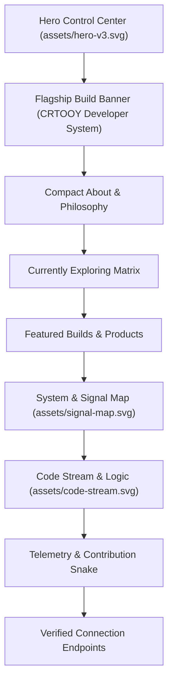

# CRTOOY PROFILE // VISUAL SYSTEM V3 — DESIGN BLUEPRINT

> Architectural and visual design specification for Gabriel Silva's GitHub Profile v3.

---

## 1. System Vision & Atmosphere

The **CRTOOY Visual System v3** bridges a **Developer Control Center**, **AI Laboratory**, and **Personal Operating System** into a cohesive, recognizable developer identity. It avoids generic templates and superficial decorations, prioritizing product-first engineering, disciplined visual typography, and genuine open-source utility.

---

## 2. Visual & Motion Design Rules

1. **Enterprise Dark Slate Palette:**
   - Primary Background: `#080c14` (Deep Space Slate)
   - Subtle Grid & Borders: `#162238` / `#1c283f`
   - Primary Accent (IBM / Core): `#0f62fe` & `#4589ff`
   - Telemetry Cyan: `#00d2d3`
   - Active Green Status: `#42be65`
   - Text Hierarchy: `#ffffff` (Headlines) / `#f8fafc` (Body) / `#94a3b8` (Muted)

2. **Background Animation Constraints:**
   - **Subtle particles & constellations:** Smooth drift (< 0.5px/sec) with low opacity (`0.15` - `0.3`).
   - **Gentle pulse:** Nodes and indicator lights pulse on 3-4s cycles.
   - **Horizontal scanline:** Slow vertical sweep with soft glow.
   - **Code symbols:** Soft floating tokens (`{ }`, `</>`, `_`, `01`, `AI`) dispersed in background layers.
   - **Zero Matrix Clutter:** No neon rain, no high-framerate flashes, no visual noise.

3. **SVG Safety & GitHub Camo Proxy Compatibility:**
   - **Absolute Coordinates:** Every `<text>` and `<tspan>` element uses explicit, independent `x` and `y` attributes.
   - **Zero Text Overlap:** Animation transitions utilize distinct vertical coordinate baselines.
   - **Static Readability Post-Boot:** The 2.5s bootstrap animation permanently settles into a fully legible, high-contrast dashboard.
   - **Dark & Light Mode Contrast:** All SVG surfaces include an opaque base container (`#080c14` with subtle rounded border `#1c283f`), ensuring crisp rendering regardless of user theme.

---

## 3. Asset Specifications

| Asset File | Dimension (viewBox) | Purpose & Key Features |
| :--- | :--- | :--- |
| `assets/hero-v3.svg` | `800 x 300` | Top control center, authentic IBM 8-bar badge, animated background grid, nodes, 2.5s boot sequence, status pill. |
| `assets/signal-map.svg` | `800 x 140` | Architectural node tree linking CRTOOY to AI, Systems, Automation, and Open Source. |
| `assets/code-stream.svg`| `800 x 120` | Minimalist execution stream with developer logic and discrete easter egg. |
| `profile-data/*.json` | Structured Data | Machine-readable schemas for identity, projects, telemetry, and system metadata. |

---

## 4. Section Structure

1. **HERO V3:** `assets/hero-v3.svg`
2. **FLAGSHIP PROJECT:** Dedicated product showcase for **CRTOOY Developer System** with direct launch & terminal badges.
3. **👨‍💻 ABOUT:** 2-line executive summary (Apprentice @ IBM Brasil, systems & AI explorer).
4. **🧠 CURRENTLY EXPLORING:** Clean categoric focus matrix (Applied AI, Automation, Linux/Systems, Software Foundations, Open Source).
5. **🚀 FEATURED BUILDS:** Card grid for `CRTOOY`, `OpenLPS Network Toolkit`, and `Bodycam FPS`.
6. **⚙️ SYSTEM SIGNAL MAP:** `assets/signal-map.svg`.
7. **💻 CODE STREAM:** `assets/code-stream.svg`.
8. **📡 GITHUB TELEMETRY & SNAKE:** Contribution animation `<picture>` (Dark/Light).
9. **🌐 CONNECT:** Clean links to GitHub, LinkedIn, and Web Console.
