  

  

  

---

### 👨‍💻 About

I am a technology enthusiast beginning my professional journey as an **Apprentice at IBM Brasil**.  
Focused on developing a solid engineering foundation, exploring applied artificial intelligence, and building efficient automation workflows with an open-source mindset.

---

### 🎯 Currently Exploring

- **Systems & Automation:** CLI tooling, reproducible development environments, and task automation.
- **Applied Artificial Intelligence:** Intelligent agents, local model integration, and developer workflows.
- **Software Foundations:** Algorithms, data structures, Linux architecture, and clean code practices.
- **Networking & Infrastructure:** Protocol analysis, security research, and system telemetry.

---

### 🚀 Featured Builds

- **[CRTOOY Developer System](https://github.com/crtooy-codes/crtooy)** &nbsp; `[Flagship]`  
  *Interactive developer operating system, engineering console, and terminal interface built with strict TypeScript & React.*  
  👉 **[Launch System](https://crtooy-codes.github.io/crtooy/)** &bull; Run via terminal: `npx crtooy`

- **[OpenLPS Network Toolkit](https://github.com/crtooy-codes/network-toolkit)**  
  *Open-source network diagnostics and security toolkit designed for authorized Android research.*

- **[Bodycam FPS Prototype](https://github.com/crtooy-codes/Bodycam-FPS)**  
  *Interactive 3D web graphics experiment exploring camera inertia, procedural audio synthesis, and WebGL physics.*

---

### 📊 GitHub Activity

  <picture>
    <source media="(prefers-color-scheme: dark)" srcset="https://raw.githubusercontent.com/crtooy-codes/crtooy-codes/output/github-contribution-grid-snake-dark.svg" />
    <source media="(prefers-color-scheme: light)" srcset="https://raw.githubusercontent.com/crtooy-codes/crtooy-codes/output/github-contribution-grid-snake.svg" />
    
  </picture>

---

### 📫 Connect

- **GitHub:** [@crtooy-codes](https://github.com/crtooy-codes)
- **LinkedIn:** [Gabriel Silva de Oliveira](https://www.linkedin.com)

---

  Personal GitHub profile. Projects and opinions expressed here are independent and solely my own.

