<p align="center">
  
</p>

<p align="center">
  <a href="https://crtooy-codes.github.io/crtooy/"></a>
  <a href="https://www.npmjs.com/package/crtooy"></a>
  <a href="https://www.linkedin.com/in/gabriel-silva-de-oliveira-/"></a>
  <a href="https://github.com/crtooy-codes"></a>
</p>

---

### 👁️ Neural-Link HUD & Biometric Verification

<p align="center">
  
</p>

---

### 🚀 Flagship Build

<table>
  <tr>
    <td>
      <h3>⚡ <a href="https://github.com/crtooy-codes/crtooy">CRTOOY Developer System</a> &nbsp; <code>[ ACTIVE // FLAGSHIP ]</code></h3>
      <p><b>Interactive Developer Operating System, Engineering Console &amp; Terminal Interface</b> built with strict TypeScript, React 18, and Node.js. Delivers genuine command execution, procedural Web Audio synthesis, interactive CRT optics, offline PWA capability, and an extensible CLI runtime.</p>
      <p>
        <b>Tech Stack:</b> <code>TypeScript Strict 5.7</code> &bull; <code>React 18</code> &bull; <code>Vite</code> &bull; <code>Node.js 22</code> &bull; <code>Web Audio API</code> &bull; <code>PWA</code> &bull; <code>Tailwind CSS</code>
      </p>
      <p>
        👉 <b><a href="https://crtooy-codes.github.io/crtooy/">Launch Web Console</a></b> &nbsp;&bull;&nbsp; 
        📦 <b><a href="https://github.com/crtooy-codes/crtooy">View Repository</a></b> &nbsp;&bull;&nbsp; 
        💻 <b>Run in Terminal:</b> <code>npx crtooy</code>
      </p>
    </td>
  </tr>
</table>

---

### 👨‍💻 About & Trajectory

Technology explorer and software builder developing an engineering trajectory as an **Apprentice at IBM Brasil**.  
Focused on architecting deterministic developer tooling, researching defensive network security, and exploring applied artificial intelligence through disciplined open-source execution.

---

### 📡 Tactical Radar & Active Build Recon

<p align="center">
  
</p>

---

### ⚡ Capabilities & Engineering Matrix

<p align="center">
  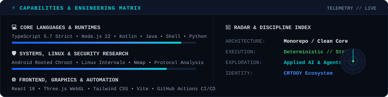
</p>

---

### ⚛️ 3D Quantum Chassis & Isometric Tensor Core

<p align="center">
  
</p>

---

### 🎛️ Procedural Web Audio DSP & Sound Lab

<p align="center">
  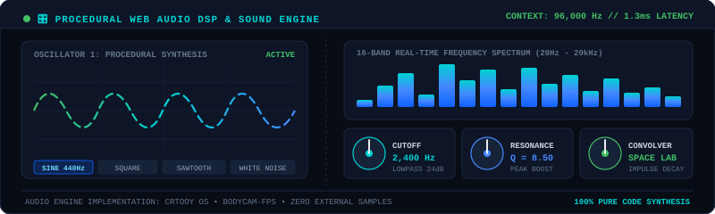
</p>

---

### 🛡️ SecOps & Network Diagnostics Lab

<p align="center">
  
</p>

* **Educational Security Runtimes:** HTTP Security Header Auditing (`CSP`, `HSTS`, `X-Frame-Options`), Shannon Entropy Analysis, Subnet/CIDR IPv4 Math, and OWASP Top 10 Mitigation Blueprints.
* **Explore Live in Terminal:** Run `secops` inside the **[Web Console](https://crtooy-codes.github.io/crtooy/)** or via `npx crtooy secops`.

---

### 🚀 Featured Builds

<table>
  <tr>
    <td width="50%" valign="top">
      <h4>🛡️ <a href="https://github.com/crtooy-codes/network-toolkit">OpenLPS Network Toolkit</a> &nbsp; <code>[ ACTIVE ]</code></h4>
      <p>Open-source Android network diagnostics and defensive security research toolkit designed for authorized testing in rooted environments.</p>
      <p><b>Stack:</b> <code>Kotlin</code> &bull; <code>Java</code> &bull; <code>Android Root</code> &bull; <code>Chroot</code> &bull; <code>Nmap</code></p>
      <p>👉 <a href="https://github.com/crtooy-codes/network-toolkit"><b>Repository</b></a> &bull; <a href="https://crtooy-codes.github.io/network-toolkit/"><b>Documentation</b></a></p>
    </td>
    <td width="50%" valign="top">
      <h4>🎮 <a href="https://github.com/crtooy-codes/Bodycam-FPS">Bodycam FPS Prototype</a> &nbsp; <code>[ PROTOTYPE ]</code></h4>
      <p>Interactive 3D simulation exploring tactical bodycam distortion shaders, procedural Web Audio synthesis, and WebGL physics.</p>
      <p><b>Stack:</b> <code>TypeScript</code> &bull; <code>React 18</code> &bull; <code>Three.js</code> &bull; <code>WebGL</code> &bull; <code>Vite</code></p>
      <p>👉 <a href="https://github.com/crtooy-codes/Bodycam-FPS"><b>Repository</b></a></p>
    </td>
  </tr>
</table>

---

### ⚙️ System Architecture & Signal Data-Bus

<p align="center">
  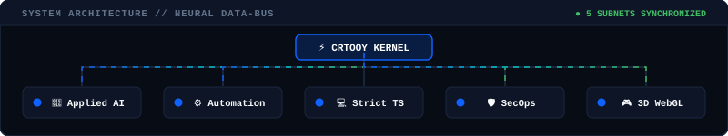
</p>

---

### 💻 Developer Logic Stream

<p align="center">
  
</p>

---

### 📟 Quantum Command Console

<p align="center">
  
</p>

---

### 📡 Live Engineering Telemetry & Pulse

<p align="center">
  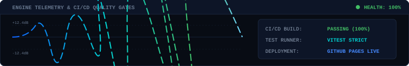
</p>

---

### 📂 Classified Cyberdeck Archives & Technical Blueprints

<details>
<summary><b>[ 🔓 ACCESS ARCHIVE: /system/kernel/blueprint.sys ] — System Architecture Diagram</b></summary>

```text
========================================================================================
                      CRTOOY KERNEL ARCHITECTURE BLUEPRINT v4.0
========================================================================================

  [ USER INTERFACES ]
   +---------------------------------------+---------------------------------------+
   |   Web OS Desktop Console (PWA)        |   Terminal CLI Runtime (npx crtooy)   |
   +---------------------------------------+---------------------------------------+
                      |                                        |
                      +-------------------+--------------------+
                                          |
  [ DISPATCH & EVENT BUS ]                v
   +-------------------------------------------------------------------------------+
   |                      Deterministic Command Dispatcher                         |
   |           [ Audio Engine ]   [ 3D WebGL ]   [ SecOps Lab ]   [ AI Agent ]     |
   +-------------------------------------------------------------------------------+
                      |                   |              |               |
  [ CORE RUNTIMES ]   v                   v              v               v
   +----------------------+  +------------------+  +-----------+  +----------------+
   |  Web Audio DSP API   |  | Three.js Shaders |  |  Chroot   |  | Local / Cloud  |
   |  Procedural Synth    |  | WebGL Physics    |  |  Security |  | LLM Runtimes   |
   +----------------------+  +------------------+  +-----------+  +----------------+
                                          |
  [ INFRASTRUCTURE LAYER ]                v
   +-------------------------------------------------------------------------------+
   |   Strict TypeScript 5.7  •  Node.js 22 ESM  •  Kotlin  •  Zero-Leak Memory    |
   +-------------------------------------------------------------------------------+
========================================================================================
```
</details>

<details>
<summary><b>[ 🎛️ ACCESS CODE: /audio/procedural-dsp.ts ] — Procedural Sound Synthesis Recipe</b></summary>

```typescript
// Pure code-driven procedural audio without external .mp3 or .wav assets
export function createProceduralBeep(ctx: AudioContext, frequency: number, duration: number): void {
  const osc = ctx.createOscillator();
  const gain = ctx.createGain();
  const filter = ctx.createBiquadFilter();

  osc.type = 'sine';
  osc.frequency.setValueAtTime(frequency, ctx.currentTime);

  filter.type = 'lowpass';
  filter.frequency.setValueAtTime(2400, ctx.currentTime);

  gain.gain.setValueAtTime(0.3, ctx.currentTime);
  gain.gain.exponentialRampToValueAtTime(0.0001, ctx.currentTime + duration);

  osc.connect(filter);
  filter.connect(gain);
  gain.connect(ctx.destination);

  osc.start();
  osc.stop(ctx.currentTime + duration);
}
```
</details>

<details>
<summary><b>[ 🛡️ ACCESS FORMULA: /secops/shannon-entropy.md ] — Cryptographic Randomness Math</b></summary>

```text
Shannon Entropy Formula:
  H(X) = - SUM [ P(x_i) * log2(P(x_i)) ]

Interpretation in OpenLPS Security:
  • H(X) ~ 0.0 -> Low entropy, predictable plain text / weak key.
  • H(X) ~ 7.8 -> High entropy, true cryptographic randomness / high-grade encryption.
```
</details>

<details>
<summary><b>[ 🕹️ ACCESS EASTER EGG: /easter-egg/bootloader.sh ] — Hidden Console Commands</b></summary>

```bash
# Curious about the full developer suite? Try running these inside the terminal:
$ npx crtooy                 # Launch interactive developer console
$ npx crtooy secops          # Run defensive HTTP & Shannon diagnostics
$ npx crtooy matrix          # Stream capabilities and benchmark logs
$ npx crtooy --version       # Show kernel compilation metadata
```
</details>

---

### 📊 GitHub Activity & Snake

<p align="center">
  <picture>
    <source media="(prefers-color-scheme: dark)" srcset="https://raw.githubusercontent.com/crtooy-codes/crtooy-codes/output/github-contribution-grid-snake-dark.svg" />
    <source media="(prefers-color-scheme: light)" srcset="https://raw.githubusercontent.com/crtooy-codes/crtooy-codes/output/github-contribution-grid-snake.svg" />
    
  </picture>
</p>

---

### 🌐 Connect

<p align="center">
  <b>GitHub:</b> <a href="https://github.com/crtooy-codes">@crtooy-codes</a> &nbsp;&bull;&nbsp;
  <b>LinkedIn:</b> <a href="https://www.linkedin.com/in/gabriel-silva-de-oliveira-/">Gabriel Silva de Oliveira</a> &nbsp;&bull;&nbsp;
  <b>CRTOOY Console:</b> <a href="https://crtooy-codes.github.io/crtooy/">crtooy-codes.github.io/crtooy</a>
</p>

---

<div align="center">
  <sub>Personal GitHub profile. Projects and opinions expressed here are independent and solely my own.</sub>
</div>
